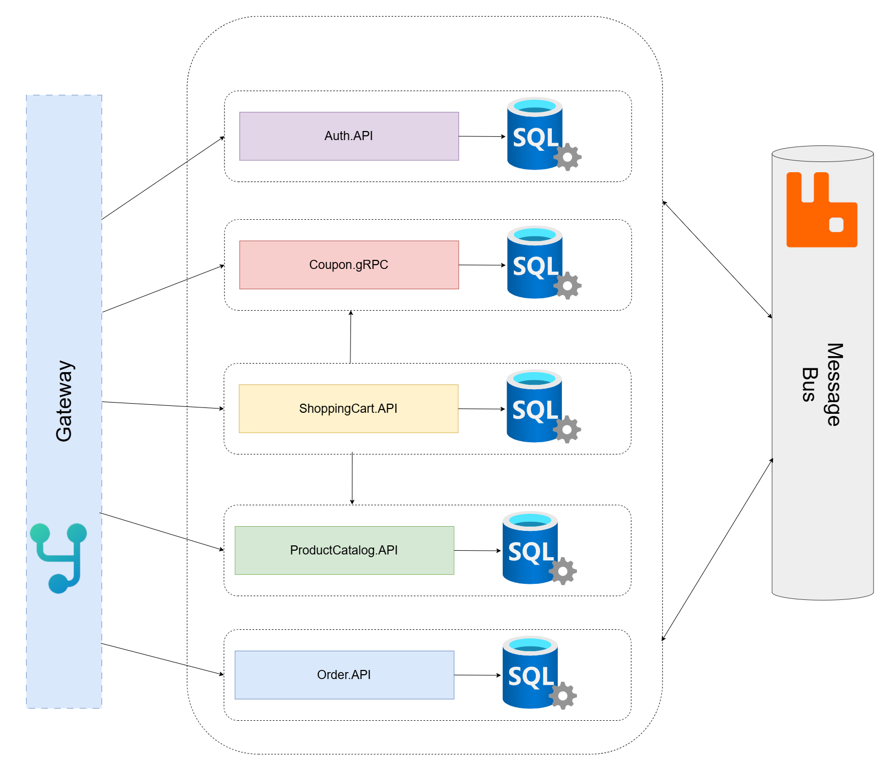

# e-Taberna
E-Taberna is a modern e-commerce web application built using a **microservices** architecture. 
The name "Taberna" is derived from the Latin word for "tavern" or "shop", historically referring to a place where goods were bought and sold. Inspired by this, e-Taberna is designed as a digital marketplace that facilitates seamless transactions and shopping experiences.


## System Architecture   
The project follows a microservices-based design, where each service is responsible for a specific domain within the e-commerce platform.


<p align="center">
  
</p>

## Tech Stack
- **.NET Core 9** for backend services  
- **YARP** for API Gateway  
- **RabbitMQ** for message-based communication  
- **gRPC** for inter-service communication  
- **SQL Server** for data persistence  


## Project Structure  

### 🏗 Building Blocks  

Contains shared modules such as **Messaging**, which provides communication mechanisms between microservices.

### 🚪 API Gateway  

Contains **YARP Gateway**, which acts as the **API gateway** for routing requests between services.


### 🛠 Services  

Independent microservices handling different domains of the application:

#### 🔐 Auth Service  
- Handles **user authentication and authorization**.  
- Uses **JWT** and **.NET Identity** for security.  

#### 📦 Order Service  
- Manages **orders, order processing, and status updates**.  
- Handles **payments via Stripe**.  
- **Publishes RabbitMQ events** on **successful payment**.  

#### 🎟️ Coupon Service  
- Manages **discounts and promotional codes**.  
- Integrates with **Stripe** for **coupon creation**.  
- Exposes a **gRPC service** for other microservices to validate and apply coupons.  

#### 🛒 ShoppingCart Service  
- Handles **cart management** (adding, updating, and removing items).  
- Acts as a **gRPC client** for the **Coupon Service** to validate and apply discounts.  
- **Consumes RabbitMQ events** from **Order Service** to delete the cart on **successful payment**.  

#### 🏷️ ProductCatalog Service  
- Manages **product listings, categories, and inventory**.  
- **Consumes RabbitMQ events** from **Order Service** to update inventory on **successful payment**.  


## Get Started

### 1. Clone the Repository  

Clone the e-Taberna project to your local machine:

```sh
git clone https://github.com/nevein25/e-taberna
cd e-taberna
```

### 2. Configure Microservices
Each microservice requires specific configurations, including database connections, authentication settings, and external service URLs.  
You can find detailed setup instructions for each microservice in their respective **README** files:

- [Auth Service README](./src/Services/Auth/README.md)
- [Order Service README](./src/Services/Order/README.md)
- [Coupon Service README](./src/Services/Coupon/README.md)
- [ShoppingCart Service README](./src/Services/ShoppingCart/README.md)
- [ProductCatalog Service README](./src/Services/ProductCatalog/README.md)
