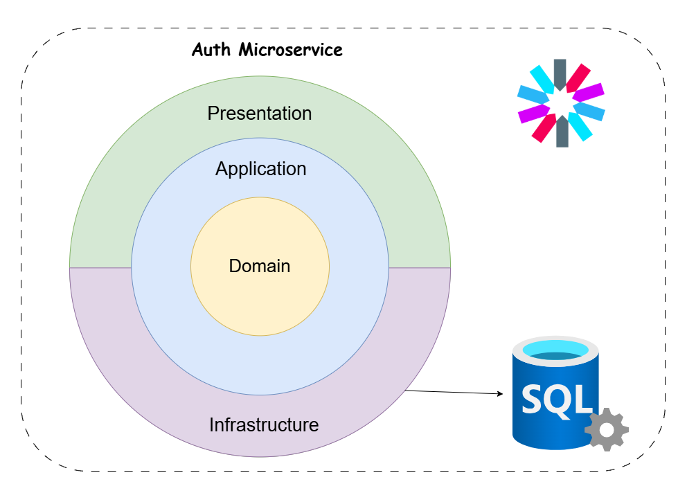

# 🔐 Auth Service 

The **Auth Service** handles user authentication and authorization in **e-Taberna**.  
It provides secure access using **JWT tokens** and **.NET Identity** for user management.


### Architecture

This service follows the Clean Architecture approach to ensure maintainability and scalability.

<p align="center">
  
</p>


## Features
- **User Registration** (Sign Up)
- **User Authentication** (Login)
- **JWT Token Generation & Validation**
- **Refresh Token Support** (Auto re-authentication)
- **Role-Based Authorization** (Using .NET Identity Roles)


## Tech Stack
- **.NET Core 9** (Web API)
- **.NET Identity** (User Management)
- **JWT Authentication** (Secure API access)
- **SQL Server** (User Data Storage)


## Setup & Installation

### Configure `appsettings.Development.json`
Create the following configuration file in the Auth microservice directory:

**Path:**  
 
```sh
e-taberna/src/Services/Auth/Auth.API/appsettings.Development.json
```

Add the following JSON content, replacing `"ADD_YOUR_OWN_VALUE"` with your actual values:

```json
{
  "ConnectionStrings": {
    "AuthDb": "ADD_YOUR_OWN_CONNECTION_STRING"
  },
  "TokenSettings": {
    "Key": "ADD_YOUR_SECRET_KEY",
    "ExpiryInMinutes": 10,
    "Issuer": "e-taberna",
    "Audience": "e-taberna-client"
  },
  "RefreshTokenSettings": {
    "ExpiryInDays": 7
  }
}
```
## Start the Microservice
### 1. Navigate to the Auth service directory:

```sh
cd src/Services/Auth/Auth.API
```

### 2. Build the project:
```sh
dotnet build
```

### 3. Run the microservice:

```sh
dotnet run --project Auth.API