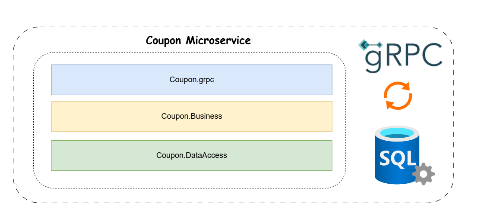

# 🎟️ Coupon Service

The **Coupon Service** handles discount coupons in **e-Taberna**. It is built as a **gRPC microservice** following a **3-tier architecture** for better separation of concerns.


## Architecture

This service follows the **3-tier architecture**:


<p align="center">
  
</p>


## Features

- **gRPC API for Coupon Management**
- **Create, Retrieve, and Update Coupons**
- **Integrates with Stripe for Coupon Creation**


## Tech Stack

- **.NET Core 9** (gRPC Server)
- **SQL Server** (Database)
- **gRPC** (High-performance RPC framework)


## Setup & Installation

### Configure `appsettings.Development.json`

Create the following configuration file in the `Coupon` microservice directory:

**Path:**

```sh
e-taberna/src/Services/Coupon/Coupon.grpc/appsettings.Development.json
```

📝 **Add the following JSON content, replacing `"ADD_YOUR_OWN_VALUE"` with actual values:**

```json
{
  "ConnectionStrings": {
    "CouponDb": "ADD_YOUR_OWN_CONNECTION_STRING"
  },
    "TokenSettings": {
    "Key": "ADD_YOUR_SECRET_KEY",
    "Issuer": "e-taberna",
    "Audience": "e-taberna-client"
  },
  "StripeSettings": {
    "SecretKey": "ADD_YOUR_STRIPE_SECRET_KEY"
  },
}
```

---

## Run the Microservice

### 1. Navigate to the Coupon service directory:

```sh
cd src/Services/Coupon/Coupon.grpc
```

### 2. Build the project:

```sh
dotnet build
```

### 3. Run the microservice:

```sh
dotnet run --project Coupon.Grpc
```

