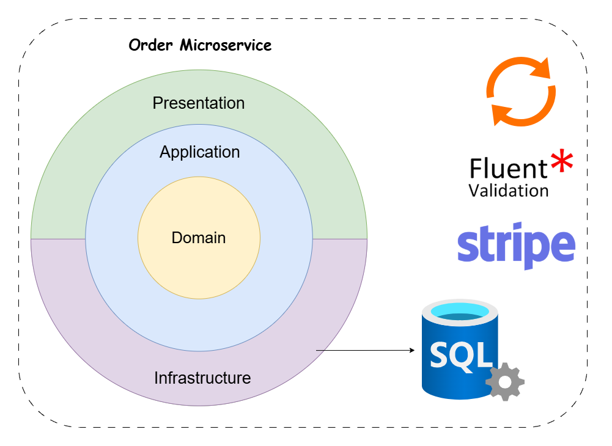

# 📦 Order Service

The **Order Service** handles order processing, payments, and order management in **e-Taberna**. It integrates **Stripe** for secure payments and follows **CQRS** principles.


## Architecture

This service follows the Clean Architecture approach, ensuring maintainability and scalability. It also includes a Shared Kernel layer for cross-cutting concerns and reusable components.


<p align="center">
  
</p>


## Features

- **Order Placement & Management**
- **Stripe Payment Integration**
- **Publishes Order Paid Events via RabbitMQ**


## Tech Stack

- **.NET Core 9** 
- **Clean Architecture**
- **CQRS Pattern with Custom Mediator Implementation**
- **Stripe API** (Payment Processing)
- **SQL Server** (Order Data Storage)
- **RabbitMQ** (Event Messaging)

---

## Setup & Installation

### Configure `appsettings.Development.json`

Create the following configuration file in the `Order` microservice directory:

**Path:**

```sh
e-taberna/src/Services/Order/Order.API/appsettings.Development.json
```

Add the following JSON content, replacing `"ADD_YOUR_OWN_VALUE"` with your actual values:

```json
{
  "ConnectionStrings": {
    "OrderDb": "ADD_YOUR_OWN_CONNECTION_STRING"
  },
  "TokenSettings": {
    "Key": "ADD_YOUR_SECRET_KEY",
    "Issuer": "e-taberna",
    "Audience": "e-taberna-client"
  },
  "StripeSettings": {
    "PublicKey": "ADD_YOUR_STRIPE_PUBLIC_KEY",
    "SecretKey": "ADD_YOUR_STRIPE_SECRET_KEY"
  },
  "RabbitMQ": {
    "Host": "ADD_YOUR_RABBITMQ_HOST",
    "UserName": "ADD_YOUR_RABBITMQ_USERNAME",
    "Password": "ADD_YOUR_RABBITMQ_PASSWORD"
  }
}
```


## Start the Microservice
### 1. Navigate to the Order service directory:

```sh
cd src/Services/Order/Order.API
```

### 2. Build the project:
```sh
dotnet build
```
### 3. Run the microservice:

```sh
dotnet run --project Order.API
```