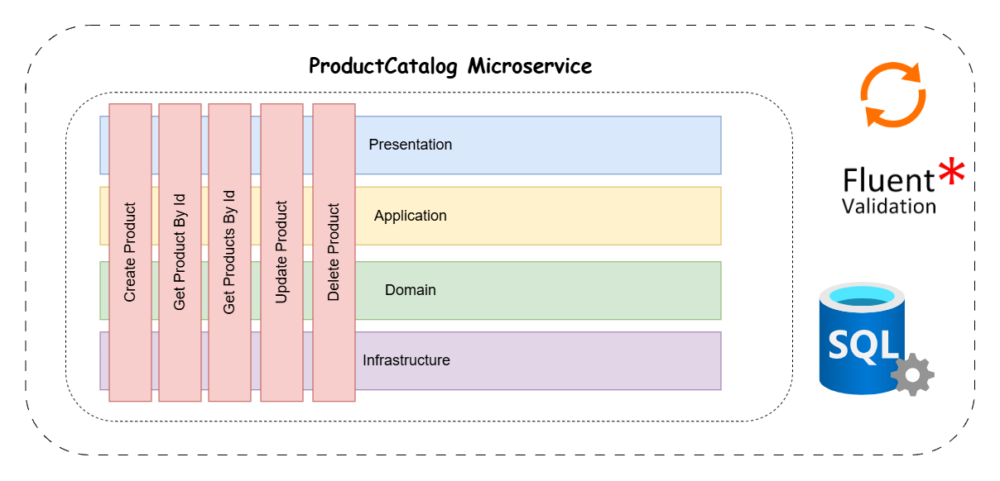

# 🏷️ Product Catalog Microservice

The **Product Catalog Microservice** manages products within the **e-Taberna** ecosystem. It provides endpoints for creating, retrieving, updating, and deleting products, following the **Vertical Slice Architecture** for better modularity and maintainability.


## Architecture

This service follows the **Vertical Slice Architecture**, ensuring that each feature is encapsulated independently.


<p align="center">
  
</p>


## Features

-  **Create Product**
-  **Get Product By Id**
-  **Get Products By Id**
-  **Update Product**
-  **Delete Product**
-  **RabbitMQ Consumer – Listens for successful payment events to update inventory**


## Tech Stack

- **.NET Core 9** (Minimal API)
- **Fluent Validation** (Request validation)
- **SQL Server** (Product data storage)
- **RabbitMQ (Message Broker for Payment Events)**

---

## Setup & Installation

### Configure `appsettings.Development.json`

Create the following configuration file in the `ProductCatalog` microservice directory:

📂 **Path:**

```sh
e-taberna/src/Services/ProductCatalog/ProductCatalog.API/appsettings.Development.json
```

📝 **Add the following JSON content, replacing `ADD_YOUR_OWN_VALUE` with actual values:**

```json
{
  "ConnectionStrings": {
    "ProductCatalogDb": "ADD_YOUR_OWN_CONNECTION_STRING"
  },
    "TokenSettings": {
    "Key": "ADD_YOUR_SECRET_KEY",
    "Issuer": "e-taberna",
    "Audience": "e-taberna-client"
  },
  "StripeSettings": {
    "PublicKey": "ADD_YOUR_STRIPE_PUBLIC_KEY",
    "SecretKey": "ADD_YOUR_STRIPE_SECRET_KEY"
  },
  "RabbitMQ": {
    "Host": "ADD_YOUR_RABBITMQ_HOST",
    "UserName": "ADD_YOUR_RABBITMQ_USERNAME",
    "Password": "ADD_YOUR_RABBITMQ_PASSWORD"
  }
}
```

---

## Run the Microservice

### 1. Navigate to the ProductCatalog service directory:

```sh
cd src/Services/ProductCatalog/ProductCatalog.API
```

### 2. Build the project:

```sh
dotnet build
```

### 3. Run the microservice:

```sh
dotnet run --project ProductCatalog.API
```


