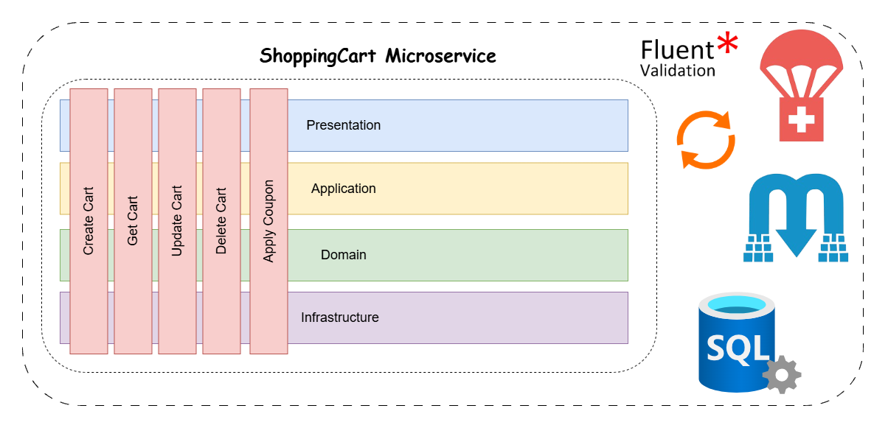

# 🛒 ShoppingCart Service

The **ShoppingCart Service** handles cart management in **e-Taberna**. It follows **Vertical Slice Architecture** and utilizes **CQRS with MediatR** for clear separation of concerns.


##  Architecture

This service follows the **Vertical Slice Architecture**, ensuring that each feature is encapsulated independently.

<p align="center">
  
</p>


## Features

- **Manage Shopping Carts**  Create, update, and delete shopping carts 
- **Apply Discounts via Coupons**  Integrates with the Coupon gRPC microservice to validate and apply discounts
- **Automatic Cart Cleanup on Payment Success** Listens for order payment success events via RabbitMQ and removes carts automatically


## Tech Stack

- **.NET Core 9** (Minimal API)
- **Carter** (Minimal API framework)
- **CQRS** (Command & Query Responsibility Segregation)
- **MediatR** (CQRS Implementation)
- **RabbitMQ** (Event Messaging)
- **gRPC Client** (Coupon Service Integration)
- **SQL Server** (Database)


##  Setup & Installation

### Configure `appsettings.Development.json`

Create the following configuration file in the `ShoppingCart` microservice directory:

**Path:**

```sh
e-taberna/src/Services/ShoppingCart/ShoppingCart.API/appsettings.Development.json
```

📝 **Add the following JSON content, replacing `"ADD_YOUR_OWN_VALUE"` with actual values:**

```json
{
  "ConnectionStrings": {
    "CartDb": "ADD_YOUR_OWN_CONNECTION_STRING"
  },
  "TokenSettings": {
    "Key": "very_secret_token_herevery_secret_token_herevery_secret_token_herevery_secret_token_herevery_secret_token_here",
    "Issuer": "e-taberna",
    "Audience": "e-taberna-client"
  },
  "ServiceUrls": {
    "ProductCatalogAPI": "https://localhost:7272",
    "OrderAPI": "https://localhost:7021",
    "CouponGrpc": "https://localhost:7271"
  },
    "RabbitMQ": {
    "Host": "ADD_YOUR_RABBITMQ_HOST",
    "UserName": "ADD_YOUR_RABBITMQ_USERNAME",
    "Password": "ADD_YOUR_RABBITMQ_PASSWORD"
  },
}
```


## Run the Microservice

### 1. Navigate to the ShoppingCart service directory:

```sh
cd src/Services/ShoppingCart/ShoppingCart.API
```

### 2. Build the project:

```sh
dotnet build
```

### 3. Run the microservice:

```sh
dotnet run --project ShoppingCart.API
```


